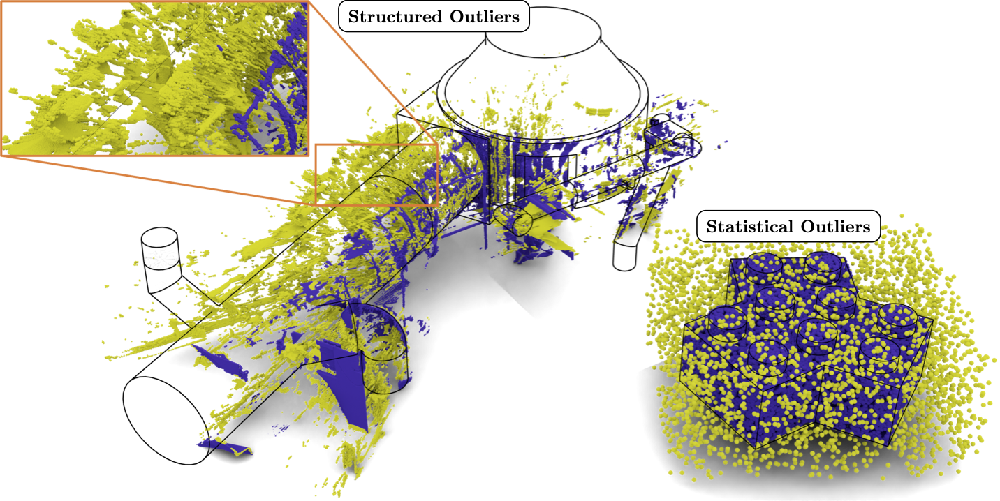

# Description
This repository contains the code and data associated with the paper [ReVISOR: ResUNets with visibility and intensity for structured outlier removal](https://www.sciencedirect.com/science/article/abs/pii/S0924271623001533).

Laser acquisition of large-scale point clouds is prone to several categories of measurement errors, which can lead, in particular, to the presence of undesirable outlier points. Existing outlier detection techniques are primarily based on analyzing local properties of point distributions to distinguish “clean” from “noisy” data. In contrast, real-world acquisition often has to deal with reflective surfaces, which can give rise to structured outliers that can be indistinguishable from clean geometry through purely local analysis. We make several contributions to address the problem of reflection-induced outlier detection. First, to overcome the scarcity of annotated data, we introduce a new dataset tailored for this task. Second, to capture non-local dependencies, we study and demonstrate, for the first time, the utility of deep learning based semantic segmentation architectures for reflection-induced outlier detection. By doing so, we bring together the fields of shape denoising/repair and semantic segmentation. Third, we demonstrate that additional non-local cues in the form of laser intensity and a computed visibility signal help boost the performance considerably. We denote our pipeline as ResUNets with Visibility and Intensity for Structured Outlier Removal, or ReVISOR, and demonstrate its superior performance against existing baselines on real-world data.

<p align="center">
  
</p>

# Installation
Run the following command to create a conda environment with the required libraries:
```bash
conda env create -n revisor --file environment.yml
```
Please refer to the instructions in the repository [CloserLook3D](https://github.com/zeliu98/CloserLook3D) to compile the custom point operators.

# Main files
- The script ```train_eval_dist.py``` allows to train a new model from scratch and evaluates the output on the test data specified.
- The notebook ```evaluate.ipynb``` allows to evaluate a model on a set of .ply files.

# Acknowledgment
Our code is based on the [Pytorch implementation of the paper A Closer Look at Local Aggregation Operators in Point Cloud Analysis](https://github.com/zeliu98/CloserLook3D).

This work was funded by EDF R&D and the ANRT as part of the CIFRE grant 2019/0433.

# Citation
If this code contributes to academic work, please cite:
```bib
@article{KIRGO2023184,
title = {ReVISOR: ResUNets with visibility and intensity for structured outlier removal},
journal = {ISPRS Journal of Photogrammetry and Remote Sensing},
volume = {202},
pages = {184-204},
year = {2023},
issn = {0924-2716},
doi = {https://doi.org/10.1016/j.isprsjprs.2023.05.027},
url = {https://www.sciencedirect.com/science/article/pii/S0924271623001533},
author = {Maxime Kirgo and Guillaume Terrasse and Guillaume Thibault and Maks Ovsjanikov},
keywords = {Outlier detection, Deep learning, Point cloud semantic segmentation},
}
```